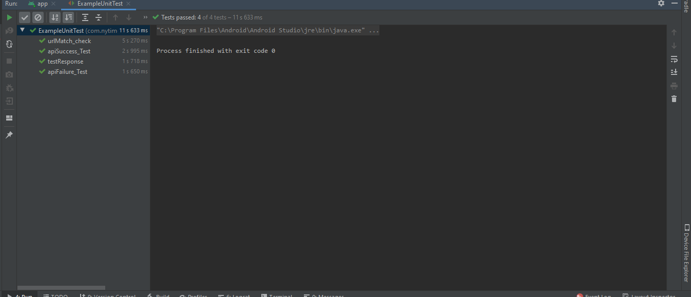

# MVVM-NY-Times-Most-Popular-Articles-Android

MVVM-NY-Times-Most-Popular-Articles-Android is MVVM sample project which shows popular news which is fetch from NY Times API.

**This application was done using MVVM + RXAndroid + Koin + LiveData + Retrofit.**

- MVVM Design Architecture used.
- RXAndroid.
- Koin for dendency injection framework.
- Retrofit.
- Data Fetch from NY Times Popular Api
- Test Driven Development(Junit-espresso).

## Screenshots

**Please click the image below to enlarge.**

## UI Testing Screenshot

## Unit Testing Screenshot

## Code Coverage
A coverage report can be generated using `gradlew createDebugCoverageReport`command-line via Gradle
Then you can find it at  `app\build\reports\coverage\debug\index.html`

