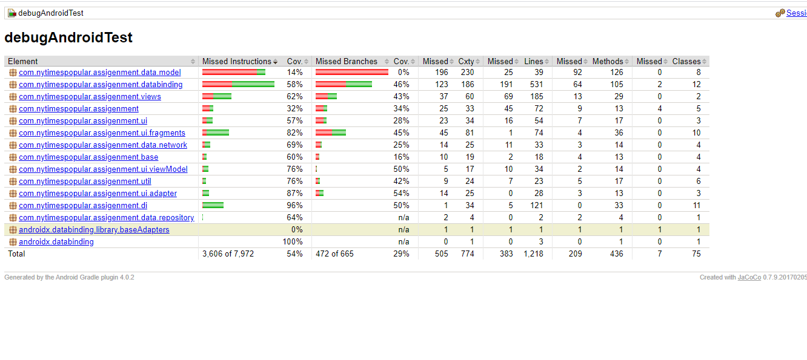

# MVVM-NY-Times-Most-Popular-Articles-Android
[](https://www.android.com)


MVVM-NY-Times-Most-Popular-Articles-Android is MVVM sample project which shows popular news which is fetch from NY Times API.

**This application was done using MVVM + RXAndroid + Koin + LiveData + Retrofit.**

- MVVM Design Architecture used.
- RXAndroid.
- Koin for dendency injection framework.
- Retrofit.
- Data Fetch from NY Times Popular Api
- Test Driven Development(Junit-espresso).


## Screenshots

**Please click the image below to enlarge.**


<p>


</p>


## UI Testing Screenshot


## Unit Testing Screenshot


## Code Coverage
A coverage report can be generated using `gradlew createDebugCoverageReport`command-line via Gradle
Then you can find it at  `app\build\reports\coverage\debug\index.html`




## Sonarqube code report


Build the project from the command-line

 ```sh
 $ git clone https://github.com/ankur-dev/NY-Times-Most-Popular.git
 $ cd NYTimesMostPopular
 $ ./gradlew clean assembleDebug
 ```

 Run static code analysis such as linting. The result will generate on path "app/build/reports/lint-results.html"

  ```sh
  $ ./gradlew clean lint
  ```

  Run unit tests.

   ```sh
   $ ./gradlew clean test
   ```

  Run Connected Android Test. Make sure mobile device or emulator connected to machine.

   ```sh
   $ ./gradlew clean connectedAndroidTest
   ```

   All Tasks in a single command line. The reports and apk will generate in "app/build/*" repository.

   ```sh
   $ ./gradlew clean test connectedAndroidTest lint assembleDebug
   ```


